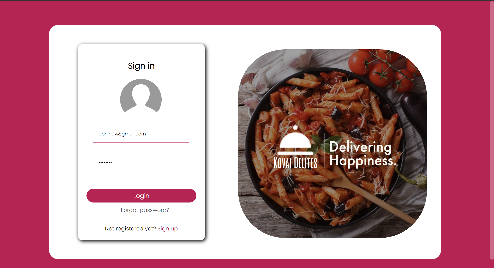

<h1 align="center">Kovai delites</h1>

Kovai Delites is a Concept Food Ordering Website designed for 40 restaurants spanning over 8 areas in Coimbatore. Done as a part of UI Design Course, Computer Science Engineering, Amrita Vishwa Vidyapeetham.

<h1 align="center">UI Screens</h1>

Screenshots of UI of the Website

 
<h2 align="center">Hero Section</h2>

<h2 align="center">Area type 1</h2>

<h2 align="center">Area type 2</h2>

<h2 align="center">Restaurant Page</h2>

<h2 align="center">Restaurant Cart</h2>

<h2 align="center">Map based Restaurant Search</h2>

<h2 align="center">Login/Signup Page</h2>

<h2 align="center">About Us</h2>

<h2 align="center">Footer</h2>

